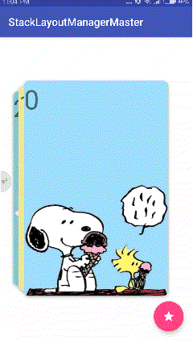
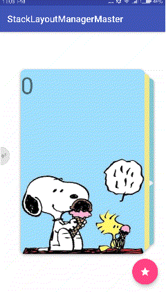

# StackLayoutManager
--------

一个实现了RecyclerView.LayoutManager的 Android 库，它能提供卡堆式展示效果。




Overview
--------

**StackLayoutManager** 有以下优点:

* **高性能**: 底层利用缓存机制，循环利用滑出屏幕之外的视图，提高视图渲染效率，避免连续滑动后造成的OOM现象。
* **灵活性**: 支持向上、向下、向左、向右四个滑动方向的配置。
* **高自定义性**: 支持自定义动画、布局效果，只需要继承*StackAnimation*或*StackLayout*即可。
* **容易使用**: 只需要创建*StackLayoutManager*对象，赋值给*RecyclerView*对象即可。

Gradle integration
------------------

如果你使用 Gradle，你可以在 gradle 文件中添加以下依赖:

```groovy
dependencies {
    implementation 'com.littlemango:stacklayoutmanager:1.0.3'
}
```

基础使用
-----------

最简单的使用方法是直接调用*StackLayoutManager*的无参构造器实例化对象之后赋值给*RecyclerView*，默认的滑动方向是从右往左。

```java
StackLayoutManager manager = new StackLayoutManager();

recyclerView.setLayoutManager(manager);
```

高级使用
--------------

1. 你可以选择子控件滑出的方向:

```java
//orientation can be one of ScrollOrientation.BOTTOM_TO_TOP or TOP_TO_BOTTOM or RIGHT_TO_LEFT or LEFT_TO_RIGHT
ScrollOrientation orientation = ScrollOrientation.BOTTOM_TO_TOP

StackLayoutManager manager = new StackLayoutManager(orientation);

recyclerView.setLayoutManager(manager);
```

2. 你可以设置在静止时可以看到的子视图的最大数量:
```java
//在构造方法中指定可见数量
StackLayoutManager manager = new StackLayoutManager(ScrollOrientation.BOTTOM_TO_TOP, 3);

//或者在稍后的设置方法中修改
manager.setVisibleItemCount(3);
```

3. 你能修改子控件之间的间隔数值:

```java
manager.setItemOffset(50);
```

4. 你可以选择平滑还是立即滚动到指定位置，使用方法和其它 RecyclerView 一样，直接调用其相应方法:
```java
//平滑的滚动到指定位置
recyclerView.smoothScrollToPosition(3);

//立即滚动到指定位置，没有动画效果
recyclerView.scrollToPosition(3);
```
5. 你可以设置像 ViewPager 一样的翻页模式，或者是普通的连续滚动模式：
```java
manager.setPagerMode(true or false);
```

6. 当处于 ViewPager 翻页模式下，你可以设置触发翻页效果的最小滑动速度:
```java
manager.setPagerFlingVelocity(3000);
```

7. 为 StackLayoutManager 增加一个 item 位置变化时的回调：
```
mStackLayoutManager.setItemChangedListener(new StackLayoutManager.ItemChangedListener() {
    @Override
    public void onItemChanged(int position) {
        mToast.setText("first visible item position is " + position);
        mToast.show();
    }
});
```

8. 如果你想自己实现动画效果，那么你可以继承自*StackAnimation*来定制动画效果，默认提供了[DefaultAnimation][DefaultAnimation]作为默认动画类:
```java
DefaultAnimation animation = new DefaultAnimation(ScrollOrientation.BOTTOM_TO_TOP, visibleCount);
manager.setAnimation(animation);
```
9. 如果你想自己实现布局效果，那么你可以继承自*StackLayout*来定制布局效果，默认提供了[DefaultLayout][DefaultLayout]作为默认布局类：
```java
StackLayoutManager manager = new StackLayoutManager(ScrollOrientation.BOTTOM_TO_TOP, 
                visibleCount,
                DefaultAnimation.class,
                DefaultLayout.class);
```

Sample
-------
你可以克隆或者下载该工程到电脑上，运行安装应用到手机上即可查看例子.

License
-------
MIT License
See [MIT License](LICENSE)

[DefaultLayout]:   StackLayoutManager/src/main/java/com/littlemango/stacklayoutmanager/DefaultLayout.kt
[DefaultAnimation]:   StackLayoutManager/src/main/java/com/littlemango/stacklayoutmanager/DefaultAnimation.kt
